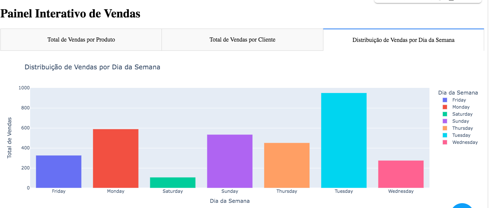

# Sales Analysis Project
## Descrição
Este projeto realiza uma análise de dados de vendas de uma empresa fictícia, utilizando consultas SQL para análise e visualizações em Python. O projeto também inclui a geração automática de relatórios em formato PDF e o envio por email.
## Tecnologias Utilizadas
- **Python**: Linguagem principal utilizada para análise e visualização.
- **Pandas**: Manipulação e análise de dados.
- **Matplotlib & Seaborn**: Criação de visualizações gráficas.
- **Plotly & Dash**: Criação de dashboards interativos.
- **SQLite**: Banco de dados para validação das consultas SQL.
## Pré-requisitos
- Python 3.8 ou superior
- Git
## Instalação
Clone o repositório:
```bash
git clone https://github.com/giuliabugatti09/sentiment-analysis-comments
cd sales-analysis-project
```
Crie um ambiente virtual e ative-o:
```bash
python -m venv venv
source venv/bin/activate  # No Windows, use: venv\Scripts\activate
```

Instale as dependências:
```bash
pip install -r requirements.txt
```
Execução do Projeto
Execute o script principal para realizar a análise e gerar os relatórios:
```bash
python scripts/main.py
```
Os relatórios serão gerados na pasta raiz do projeto e enviados para o email configurado.
Exemplos de Uso
# Exemplo de como executar uma consulta SQL
```bash
from sql_queries import execute_query
query = "SELECT * FROM sales WHERE amount > 1000"
results = execute_query(query)
print(results)
```
Visualizações
Aqui estão dois exemplos de visualizações gerados pelo projeto:

<p align="center">  </p>
<p align="center"> <images/Variacao_vendas_diarias.png" alt="Gráfico de Métricas" width="70%"> </p>

- **Validação dos Dados**:

1-O script data_validation.py realiza verificações de integridade dos dados, como verificação de valores nulos e duplicatas.
2-O script sql_queries.py executa consultas SQL para garantir a precisão das análises.

- **Google Colab**:
Você pode visualizar e interagir com os gráficos interativos diretamente no Google Colab: Link para o Google Colab-O script sql_queries.py executa consultas SQL para garantir a precisão das análises.

- **Contribuição**:
Contribuições são bem-vindas! Sinta-se à vontade para abrir issues e pull requests.

- **Licença**:
Este projeto está licenciado sob a Licença MIT.

- **Contato**:
Para dúvidas ou sugestões, entre em contato através do email: giuliabugatti02@gmail.com


